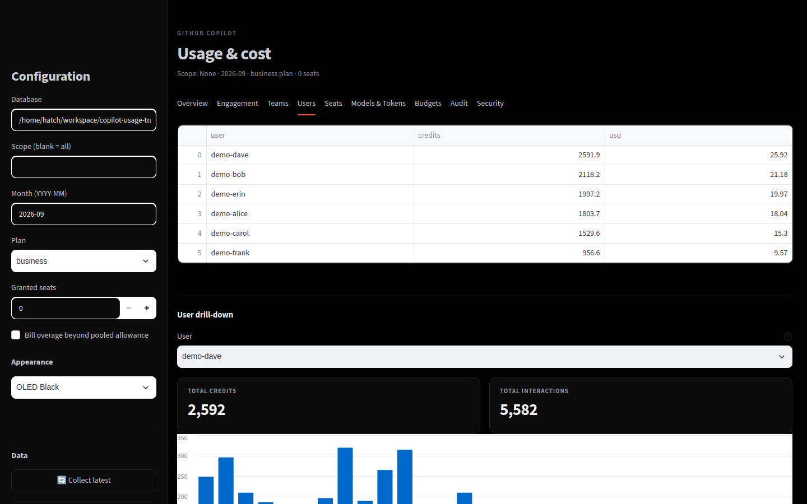
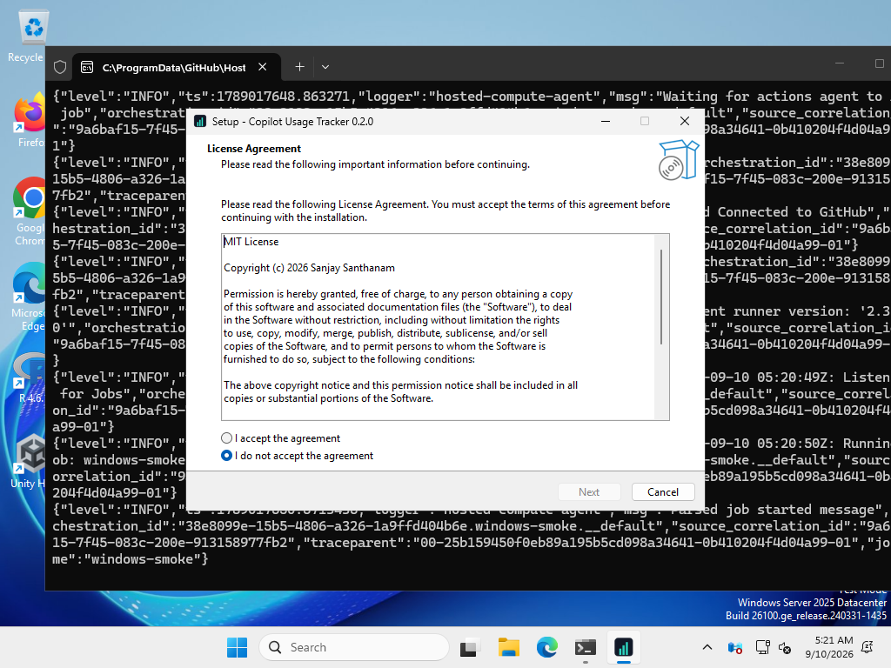

# copilot-usage-tracker

Usage & cost tracking for **GitHub Copilot at enterprise scale**, built for
engineering leaders and FinOps: per-user AI-credit consumption, dollar costs,
month-over-month trends, unusual-activity alerts, team attribution, budgets,
and one-click executive summaries — on top of GitHub's official usage
metrics and billing APIs.

## Screenshots

First-run setup — everything happens in the app window, no terminal:


The Overview tab: month-over-month KPI deltas, the unusual-activity watch
list, and month-end forecast:


The Users tab: top consumers plus a per-user drill-down with daily credit
and interaction charts:



The Windows installer:




*Provenance: the app screenshots render fictional demo data
(`docs/screenshots/seed_demo.py`) in a headless browser — no real user
data. The installer shots were captured on a genuine Windows machine
during CI.*

## Why now

On **June 1, 2026**, GitHub replaced flat per-seat Copilot billing with
**usage-based billing in AI Credits** (1 credit = $0.01), metered on the
tokens each model actually processes. Then on **September 1, 2026**, the
promotional allowance window ended and included credits dropped sharply
overnight — Business seats went from 3,000 to 1,900 credits/month,
Enterprise from 7,000 to 3,900 — with no change to seat prices.

Enterprises went from "we pay $19/$39 a seat" to "we have a variable,
per-token cloud bill with no native chargeback." This project is the
FinOps layer GitHub doesn't ship: track it, attribute it, budget it.

## What it does

- **Per-user credit tracking** — pulls the daily per-user usage reports
  (`ai_credits_used` per user, per day) into a local time series.
- **Real input/output token counts** — the AI usage report export gives
  per-user, per-day, per-model `input`, `output`, `cache_read`,
  `cache_write` tokens with dollar amounts (the only server-side
  token-level source GitHub exposes).
- **Real dollars, not guesses** — 1 AI credit = $0.01, plus exact per-model
  billing figures from GitHub's AI-credit billing API
  (gross / allowance-covered / net-billed).
- **Month-over-month KPI deltas** — the Overview tab shows total cost,
  credits used, active users, and allowance utilization with signed
  deltas against the previous month, so trends are visible at a glance.
- **Unusual-activity alerts** — flags users whose latest day's credits are
  at least 3× their trailing daily average, worth a quick look for
  runaway agents or shared accounts.
- **User drill-down** — pick any user on the Users tab for their daily
  credit burn and interaction charts, plus month totals.
- **Executive summary export** — one click downloads a Markdown brief of
  the month (KPIs, deltas, top consumers, forecast) for sharing with
  finance or leadership.
- **Team attribution** — implements GitHub's documented user-teams join so
  every credit can be charged back (or shown back) to a team. Honors the
  5-seat reporting threshold and multi-team double-counting rules.
- **Budgets & chat alerts** — monthly budgets with warn/breach thresholds;
  paste a Slack/Teams incoming-webhook URL in Settings and alerts are
  delivered to chat automatically after every collection (test button
  included).
- **Seat optimization** — the Seats tab lists dormant seats (no usage in
  30 days) with reclaimable dollars per month, downloadable as CSV.
- **Engagement analytics** — Copilot interactions, lines of code added,
  engaged-user rate, and per-day trends on the Engagement tab.
- **Month-end forecasting** — the Overview tab projects month-end credits
  and cost from the daily run rate, so the allowance never surprises
  finance.
- **Background auto-collection** — the tray app refreshes data on a
  schedule (every 6 hours by default, adjustable in Settings); the
  dashboard is always fresh with zero clicks.
- **Audit log viewer** — every GitHub API call the app makes, inspectable
  in the dashboard for compliance reviews (auth headers never logged).
- **Model analytics** — per-model and per-feature breakdowns show which
  models and surfaces (chat, agent mode, code review, CLI) burn the credit
  pool fastest.

## Install

**No terminal needed.** Grab the installer from the
[Releases page](https://github.com/Sanjays2402/copilot-usage-tracker/releases)
— a setup wizard on Windows, a drag-to-Applications DMG on macOS. Launch
the app and it walks you through a one-time setup **inside the window**:
enter your organization or enterprise, paste a GitHub token (stored only
in your OS keyring, never in a file), and click **Collect latest**. That's
it — no PowerShell, no commands.

The app lives in the system tray (Windows) or menu bar (macOS); click the
icon to pop up the dashboard. The dashboard sidebar has **Collect latest**
and **Settings**, so day-to-day use never leaves the GUI. See
[packaging/](packaging/) for build, signing, and notarization details.

## From source (developers)

```bash
pip install -e ".[dashboard]"
export COPILOT_ORG="acme-corp"   # or COPILOT_ENTERPRISE="acme"
streamlit run dashboard/app.py
```

The CLI (`copilot-usage collect`, `report`, `billing`, `budget-check`,
`estimate`, …) documents itself via `copilot-usage --help`. The token is
resolved from `GITHUB_TOKEN`, the OS keyring, the `gh` CLI, or a hidden
prompt — the tool never stores it anywhere.

Required token permissions: enterprise/org owner, billing manager, or a
custom role with **View Enterprise Copilot Metrics**. The tool is strictly
read-only against GitHub — it never writes to your org.

## Security

Built so a security review can say yes:

- **Read-only GitHub access** — the app only calls reporting and billing
  endpoints; it cannot modify your org in any way.
- **Your token is never stored by the app** — resolved once per process
  from the environment, OS keyring, `gh` CLI, or a hidden prompt, and
  never written to disk by the tool.
- **Local-first** — usage data lives in SQLite on your machine; the only
  network calls are to your GitHub API endpoint. No third-party
  telemetry.
- **Auditable** — every API call is appended to an `audit.jsonl` trail
  (auth headers never logged), viewable in the dashboard's Audit tab.
- **Enterprise adaptable** — `policy.yaml` enforces scope allowlists,
  aggregate-only mode (no per-user rows), salted user pseudonymization,
  retention with auto-purge, plus corporate proxy/CA and GitHub
  Enterprise Server support.

Full threat model and verification steps: [SECURITY.md](SECURITY.md).
Enterprise deployment guide: [docs/ENTERPRISE.md](docs/ENTERPRISE.md).

## FAQ

**Where does the data come from?**
GitHub's report APIs (daily per-user `ai_credits_used` NDJSON), the
AI-credit billing API (exact gross / allowance-covered / net-billed
dollars), and the AI usage report CSV export (per-user, per-day, per-model
tokens with dollar amounts — the only server-side token-level source).
See [docs/DATA_SOURCES.md](docs/DATA_SOURCES.md).

**Does it work with GitHub Enterprise Server?**
Yes — point the app at your GHES hostname; corporate proxies and custom
CAs are supported via `policy.yaml`. See
[docs/ENTERPRISE.md](docs/ENTERPRISE.md).

**What GitHub permissions does the token need?**
Enterprise/org owner, billing manager, or a custom role with **View
Enterprise Copilot Metrics**. Access is strictly read-only.

**How are dollar costs calculated?**
1 AI credit = $0.01. Seat cost = seats × plan price; pooled allowance =
seats × included credits; usage beyond the pool is billed as overage when
enabled. All figures live in `PriceBook` and can be calibrated to your
GitHub agreement, and the billing API provides exact billed amounts for
reconciliation.

**What counts as a dormant seat?**
A seat with no recorded usage in the last 30 days. The Seats tab lists
them with reclaimable dollars per month and a CSV download for license
reviews.

**Where is my data stored?**
In a SQLite file on your own machine (path configurable in Settings).
The GitHub token lives in your OS keyring if you put it there — the app
itself never persists it. API calls are logged to a local append-only
`audit.jsonl`.

## How it works

```
GitHub report APIs (NDJSON) ──▶ collector ──▶ SQLite time series ──▶ cost model ──▶ reports
        │                                                        ▲
        └─ billing API (exact $) ──▶ budgets/alerts ─────────────┘
```

Details: [docs/ARCHITECTURE.md](docs/ARCHITECTURE.md) ·
Data sources & billing facts: [docs/DATA_SOURCES.md](docs/DATA_SOURCES.md)

## Pricing model it implements

| Plan | Seat | Included credits/seat/mo (pooled) |
|---|---|---|
| Copilot Business | $19 | 1,900 |
| Copilot Enterprise | $39 | 3,900 |

Inline completions and next-edit suggestions are free and unmetered; chat,
agent mode, code review, and the CLI draw from the credit pool. All figures
are configurable in `PriceBook` — calibrate to your GitHub agreement.

## Contributing

Issues and PRs welcome. The test suite is `pytest`; lint is `ruff`.
Please don't commit real usage exports — NDJSON reports contain user
activity data.

## License

MIT. See [LICENSE](LICENSE).
