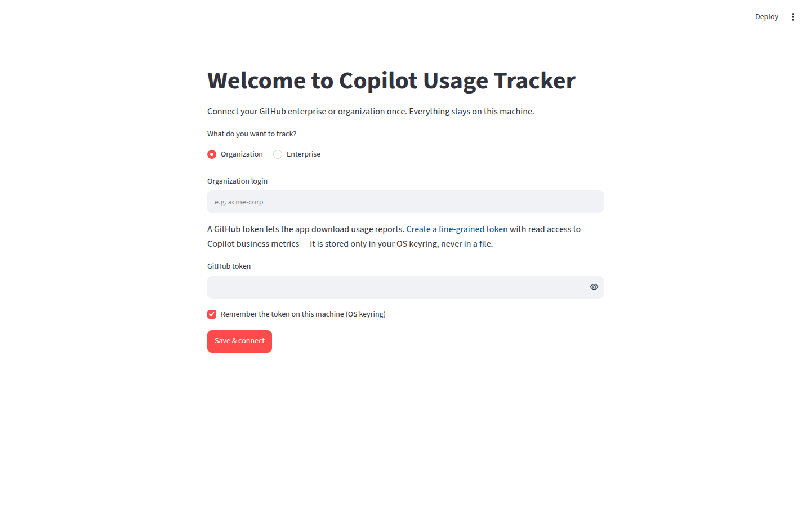
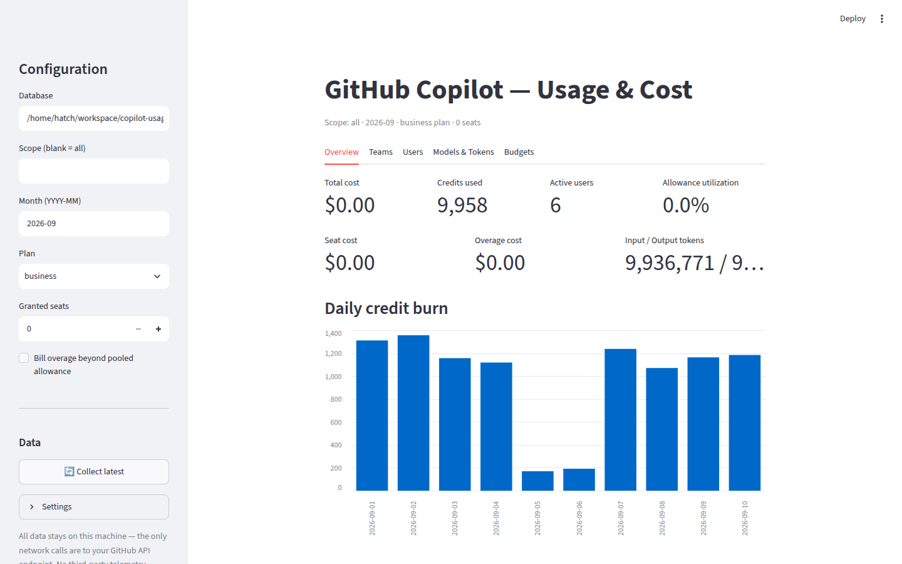
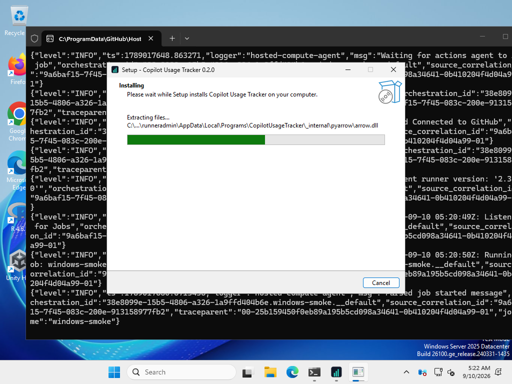

# copilot-usage-tracker

Open-source usage & cost tracking for **GitHub Copilot at enterprise scale**:
per-user AI-credit consumption, dollar costs, team attribution, budgets, and
ROI insights -- built on GitHub's official usage metrics and billing APIs.

## Install

**No terminal needed.** Grab the installer from the
[Releases page](https://github.com/Sanjays2402/copilot-usage-tracker/releases)
— a setup wizard on Windows, a drag-to-Applications DMG on macOS. Launch
the app and it walks you through a one-time setup **inside the window**:
enter your organization or enterprise, paste a GitHub token (stored only
in your OS keyring, never in a file), and click **Collect latest**. That's
it — no PowerShell, no commands.

The app lives in the system tray (Windows) or menu bar (macOS); click the
icon to pop up the dashboard. See [packaging/](packaging/) for build,
signing, and notarization details.

**From source (developers):**

## Screenshots

First-run setup — everything happens in the app, no terminal required:



The dashboard, after collecting usage (sidebar has **Collect latest** and
**Settings**, so day-to-day use never leaves the GUI):



<!--
Windows installer wizard (capture on a real Windows machine, see
docs/screenshots/CAPTURE.md):





-->

## Why now

On **June 1, 2026**, GitHub replaced flat per-seat Copilot billing with
**usage-based billing in AI Credits** (1 credit = $0.01), metered on the
tokens each model actually processes. Then on **September 1, 2026**, the
promotional allowance window ended and included credits dropped 37-44%
overnight -- Business seats went from 3,000 to 1,900 credits/month,
Enterprise from 7,000 to 3,900 -- with no change to seat prices.

Enterprises went from "we pay $19/$39 a seat" to "we have a variable,
per-token cloud bill with no native chargeback." This project is the
FinOps layer GitHub doesn't ship: track it, attribute it, budget it.

## What it does

- **Per-user credit tracking** -- pulls the daily per-user usage reports
  (`ai_credits_used` per user, per day) into a local time series.
- **Real input/output token counts** -- the AI usage report export gives
  per-user, per-day, per-model `input`, `output`, `cache_read`,
  `cache_write` tokens with dollar amounts (the only server-side
  token-level source GitHub exposes).
- **Real dollars, not guesses** -- 1 AI credit = $0.01, plus exact per-model
  billing figures from GitHub's AI-credit billing API
  (gross / allowance-covered / net-billed).
- **Team attribution** -- implements GitHub's documented user-teams join so
  every credit can be charged back (or shown back) to a team. Honors the
  5-seat reporting threshold and multi-team double-counting rules.
- **Budgets & alerts** -- per-scope (enterprise/org/team) monthly budgets
  with warn/breach thresholds; wire the alerts to Slack, email, or webhooks.
- **Seat optimization** -- find granted seats with no activity and reclaim
  them before the next billing cycle.
- **Model analytics** -- per-model and per-feature breakdowns show which
  models and surfaces (chat, agent mode, code review, CLI) burn the credit
  pool fastest.
- **Repo-level insights** -- per-repository coding-agent and code-review
  activity for AI-readiness reporting.
- **Forecasting** -- trend current burn against the post-September allowance
  so the smaller pool never surprises finance.

See [docs/ROADMAP.md](docs/ROADMAP.md) for what's next (dashboard, warehouse
sinks, anomaly detection, ROI module).

## Quickstart

```bash
pip install -e "."

export COPILOT_ENTERPRISE="acme"       # or COPILOT_ORG="acme-corp"

# Authenticate (token resolved from env, OS keyring, gh CLI, or a hidden
# prompt; the tool itself never stores it anywhere)
copilot-usage login

# Collect yesterday's usage (add --with-teams for team rollups)
copilot-usage collect --day 2026-09-08 --with-teams

# Pull per-model input/output token data (AI usage report export)
copilot-usage export-tokens --year 2026 --month 9

# Dollar-cost report for the month
copilot-usage report --month 2026-09 --plan business --seats 250 --overage

# Exact billing items straight from GitHub (enterprise scope)
copilot-usage billing --year 2026 --month 9

# Check a team budget
copilot-usage budget-check --limit 500 --spent 420 --scope team:platform

# What-if estimate
copilot-usage estimate --credits 45000 --seats 250 --plan business --overage
```

Required token permissions: enterprise/org owner, billing manager, or a
custom role with **View Enterprise Copilot Metrics**. The tool is strictly
read-only against GitHub -- it never writes to your org.

## Dashboard

```bash
pip install -e ".[dashboard]"
streamlit run dashboard/app.py
```

Five tabs over the collected data: **Overview** (cost, credits, active
users, allowance utilization, daily burn), **Teams** (chargeback
leaderboard), **Users** (top consumers with dollar costs), **Models &
Tokens** (per-model input/output/cache tokens and spend), and **Budgets**
(monthly budget vs. actual with warn/breach alerts). Configure the database
path, scope, month, plan, seats, and overage policy in the sidebar.

## Desktop app (system tray)

Prefer a native app over a browser tab? Install the desktop extra and run:

```bash
pip install -e ".[desktop]"
copilot-usage tray
```

The tracker then lives in the taskbar's hidden icons (Windows) or the menu
bar (macOS). On first launch it pops the setup window automatically: pick
your organization or enterprise, paste a GitHub token, and you're done —
no terminal at any point. Clicking the icon pops the dashboard up in a
native window; closing the window hides it without quitting. The
right-click menu offers **Collect latest data**, **Open in browser**, and
**Quit**. The dashboard sidebar mirrors the same controls (**Collect
latest**, **Settings** to change scope). See `tray/README.md` for
run-at-login setup and PyInstaller packaging.

## Enterprise & compliance

Built so a security review can say yes: read-only against GitHub,
local-first (SQLite on your machine, no third-party telemetry), least-
privilege tokens, an `audit.jsonl` trail of every API call, and a
`policy.yaml` that adapts the tool to company rules — scope allowlists,
aggregate-only mode (no per-user rows), user pseudonymization, retention
with auto-purge, corporate proxy/CA support, and GitHub Enterprise Server.

```bash
copilot-usage init-policy --preset strict   # standard | strict | aggregate
```

Full guide: [`docs/ENTERPRISE.md`](docs/ENTERPRISE.md).

## How it works

```
GitHub report APIs (NDJSON) ──▶ collector ──▶ SQLite time series ──▶ cost model ──▶ reports
        │                                                        ▲
        └─ billing API (exact $) ──▶ budgets/alerts ─────────────┘
```

Details: [docs/ARCHITECTURE.md](docs/ARCHITECTURE.md) ·
Data sources & billing facts: [docs/DATA_SOURCES.md](docs/DATA_SOURCES.md)

## Pricing model it implements

| Plan | Seat | Included credits/seat/mo (pooled) |
|---|---|---|
| Copilot Business | $19 | 1,900 |
| Copilot Enterprise | $39 | 3,900 |

Inline completions and next-edit suggestions are free and unmetered; chat,
agent mode, code review, and the CLI draw from the credit pool. All figures
are configurable in `PriceBook` -- calibrate to your GitHub agreement.

## Contributing

Issues and PRs welcome. The test suite is `pytest`; lint is `ruff`.
Please don't commit real usage exports -- NDJSON reports contain user
activity data.

## License

MIT. See [LICENSE](LICENSE).
